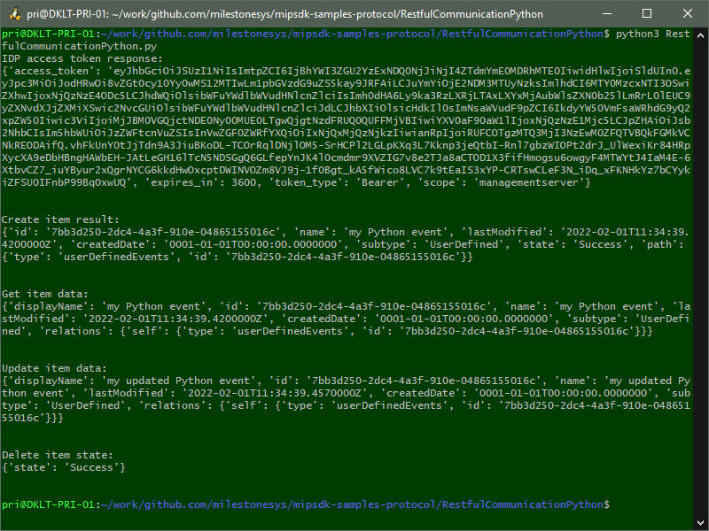

# RESTful Communication - Python

This sample shows how to use the RESTful API Gateway from a Python application. It demonstrates basic CRUD operations, as well as asynchronously invoking a task, and checking up on the task status.

The sample logs into the server, creates, gets, updates, and deletes a user-defined event, with diagnostic output along the way. In addition, it shows how to retrieve a list of cameras, and perform a task on one of these cameras.

## Prerequisites

- XProtect 2021 R2 or later.
- The API Gateway installed on the same host as the management server.
- A basic user with the Administrators role.
- A PTZ camera with PTZ Presets if you'd like to run the `cameras_and_tasks()` part of the sample.
- Python version 3.6 or newer.
- The Python package 'Requests'. To install 'Requests':
  - In a command prompt, enter `pip install requests`.
  - In Visual Studio Solution Explorer, select a Python environment under Python Environments, then from the context menu select Manage Python Packages and search for "requests".

## The sample demonstrates

- How to login using OpenID Connect/OAuth2 from a Python application
- How to access the API Gateway from a Python application
- How to use the RESTful API to perform basic CRUD operations
- How to use the RESTful API to invoke and monitor tasks

## Using

- RESTful API

## Related samples

- ComponentSamples/RestfulCommunication

## Environment

- None

## Visual Studio Python project

- [RestfulCommunicationPython.pyproj](javascript:openLink('..\\\\ProtocolSamples\\\\RestfulCommunicationPython\\\\RestfulCommunicationPython.pyproj');)